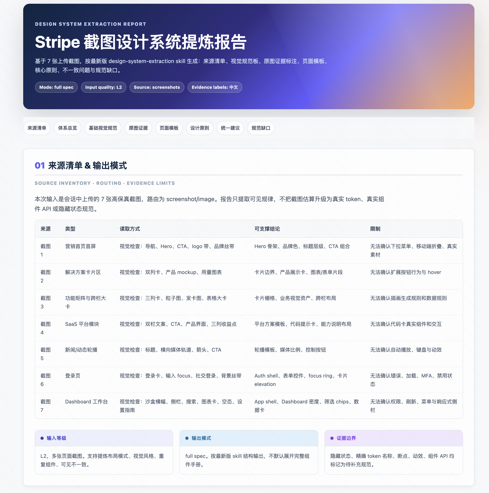
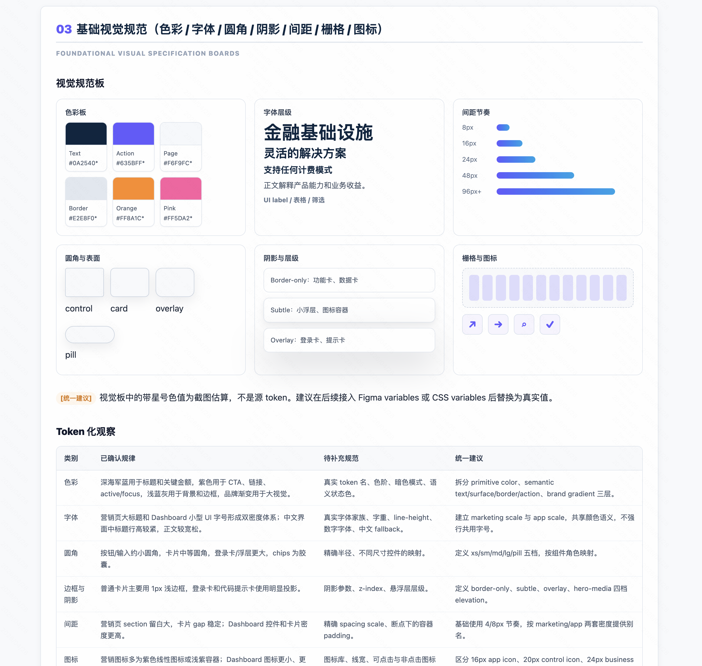
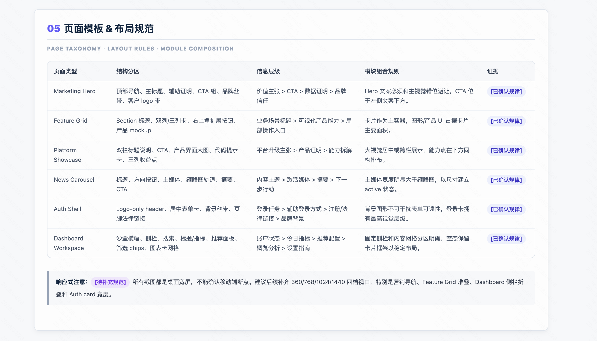
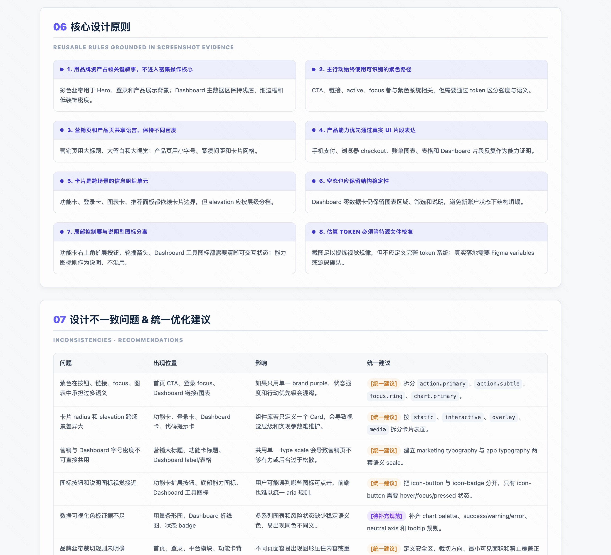
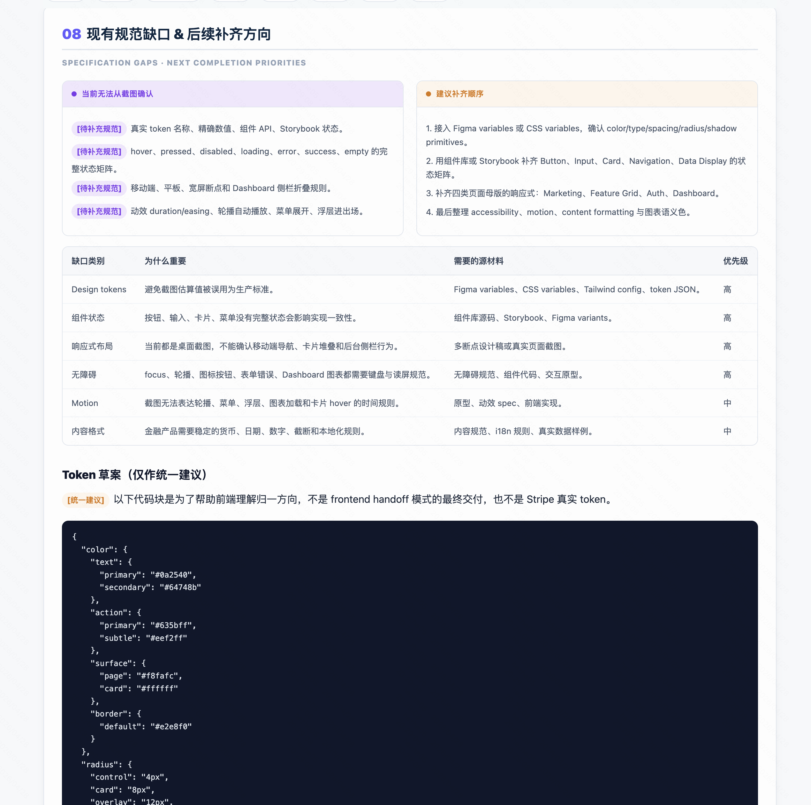

# Design System Extraction Skill

`design-system-extraction` is a reusable Codex skill for turning design source materials into structured, implementation-ready design system documentation and HTML handoff reports.

It is designed for cases where a user provides one or more of the following:

- Figma pages or frames
- screenshots or image mockups
- UI component libraries
- frontend component-library source code
- CSS variables, Tailwind themes, or design-token exports
- High-fidelity screens or mockups
- PDF, DOCX, or written design specifications
- Page-plus-component sets
- Partial or incomplete design specifications
- mixed design-source packages

Instead of redesigning the UI, this skill extracts the underlying system:

- visual language and design tokens
- page templates and layout patterns
- contextual visual evidence inside relevant sections
- visualized typography, spacing, radius, border, shadow, and grid rules
- inconsistencies and standardization recommendations
- specification gaps and next completion priorities
- frontend handoff artifacts such as CSS variables, Tailwind theme snippets, and Design Tokens JSON

## Repository structure

```text
.
├── README.md
├── LICENSE
└── design-system-extraction/
    ├── SKILL.md
    ├── LICENSE.txt
    ├── agents/
    │   └── openai.yaml
    └── references/
        ├── input-routing-modes-html.md
        └── output-examples.md
```

## What makes this skill useful

- It supports both Chinese and English triggers
- It automatically matches the output language to the user's request
- It distinguishes observed facts from recommended standardization
- It routes Figma, screenshots, component code, token files, PDF specs, and mixed inputs differently
- It supports `quick audit`, `full spec`, and `frontend handoff` output modes
- It defaults to a standalone HTML deliverable
- It uses a polished card-based analysis report style with a gradient header, compact tables, evidence badges, insight callouts, and responsive comparison grids
- It is optimized for implementation-ready output rather than page-by-page critique
- It includes frontend-ready formats for CSS custom properties, Tailwind theme extension, and Design Tokens JSON
- It includes a reference file with Chinese and English output examples

## Install in Codex

This repository is ready to install from GitHub by pointing Codex at the skill folder path inside the repo.

Example:

```text
$skill-installer install https://github.com/Ramones2333/Design-System-Extraction-skill/tree/main/design-system-extraction
```

Or install from a repo/path pair:

```text
scripts/install-skill-from-github.py --repo Ramones2333/Design-System-Extraction-skill --path design-system-extraction
```

After installing, restart Codex so the new skill is picked up.

## Quick Start

1. Install the skill.
2. Restart Codex.
3. Confirm it is active by asking Codex: `What skills are available for design-system extraction?` or by using `$design-system-extraction` in a prompt.
4. Provide one of the following:
   - Figma page link or file
   - Component library or Storybook link
   - 5-10 high-fidelity screenshots
   - Existing partial design guidelines, PDF, or token files
5. Prompt:

```text
请使用 design-system-extraction skill，从这些页面中提炼设计系统，包括 token、视觉规范、页面模板、不一致问题和补齐方向，并输出 HTML 报告。
```

## Common Input Scenarios

- **Codex file input**: attach or point to screenshots, PDFs, token files, or component-library source. The skill will classify sources and generate an HTML report.
- **Figma MCP input**: provide a Figma page/frame link and make sure Codex has permission to inspect variables, styles, components, and frames.
- **Screenshot-only input**: provide several representative high-fidelity screenshots. The skill can extract visible visual and layout patterns, but exact token names, hidden states, component APIs, motion, and responsive rules remain limited unless supported by other sources.

## Example prompts

Chinese:

```text
用这些 Figma 页面帮我提炼完整设计系统，输出视觉规范、页面模板、统一建议和规范缺口。
```

```text
请从这套后台页面和组件库里反推 design token、页面布局规则和可视化设计规范。
```

```text
基于这些截图、PDF 规范和组件源码，输出 frontend handoff 模式的 HTML 设计系统报告，包含 CSS variables、Tailwind theme 和 Design Tokens JSON。
```

English:

```text
Use these Figma frames to extract a reusable design system with tokens, visual spec boards, page templates, and standardization recommendations.
```

```text
Reverse-engineer the UI system behind these screens and turn it into an implementation-ready design spec.
```

```text
Generate a frontend handoff HTML report from these screenshots, source files, and token exports, including CSS variables, Tailwind theme, and Design Tokens JSON.
```

## Output shape

The skill produces a standalone HTML report with embedded CSS and a card-based analysis-report layout. It supports three modes:

- `quick audit`: compact source inventory, confirmed patterns, inconsistencies, gaps, and next actions
- `full spec`: complete design-system documentation
- `frontend handoff`: full spec plus engineering-ready token and implementation artifacts

The full spec and frontend handoff modes cover:

- design system overview and style direction
- foundational visual specifications
- visual boards for color, typography, spacing, radius, shadow, grid, and iconography
- page templates and layout rules
- core design principles
- inconsistencies and standardization recommendations
- specification gaps and next completion priorities
- source inventory and file-type routing
- token inventory tables
- CSS custom properties
- Tailwind theme extension
- Design Tokens JSON
- frontend adoption checklist

## Notes for maintainers

- Keep `SKILL.md` focused on workflow and decision rules
- Put examples and format scaffolds in `references/`
- If you add more reference files, link them directly from `SKILL.md`
- Avoid turning the skill into a generic UI review skill; it is specifically for system extraction and specification

## Output Content Demo

The screenshots below demonstrate the generated HTML report structure. Each image highlights one report area and the role it plays in the final deliverable.

| Demo image | Feature summary |
|---|---|
|  | Shows the report header, source inventory, input quality level, output mode, and evidence limitations. |
|  | Summarizes the design-system positioning, style keywords, reusable layers, and evidence-backed maturity level. |
|  | Visualizes color, typography, spacing, radius, shadow, grid, iconography, and token gaps through specification boards. |
|  | Maps page types, layout zones, information hierarchy, module composition, and responsive limitations. |
|  | Turns screenshot evidence into reusable design principles and prioritized standardization recommendations. |
|  | Lists missing source materials and provides a clearly marked token draft for frontend alignment. |

## License

This repository is licensed under Apache-2.0. The skill directory also includes a `LICENSE.txt` copy so the license stays attached when the skill is installed independently.
